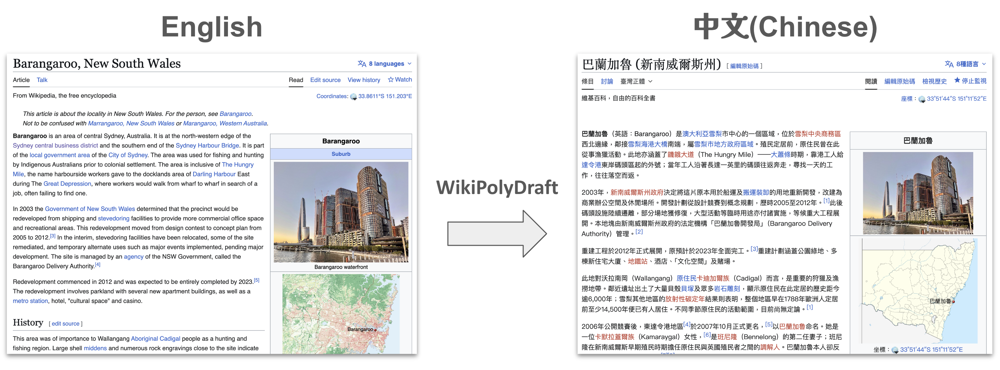
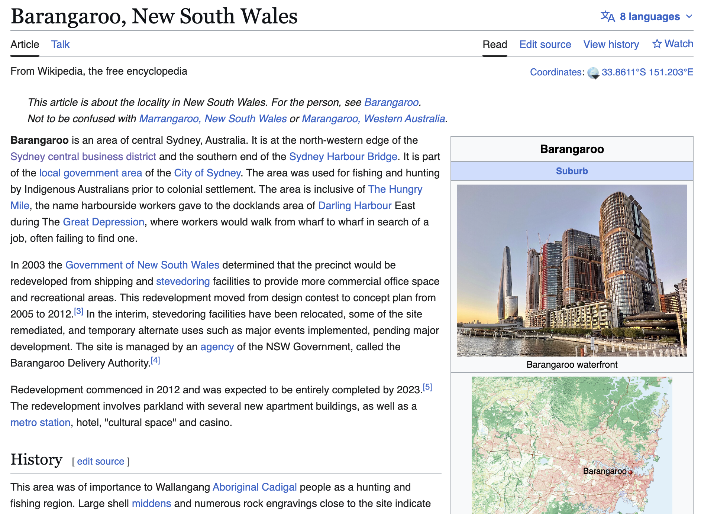
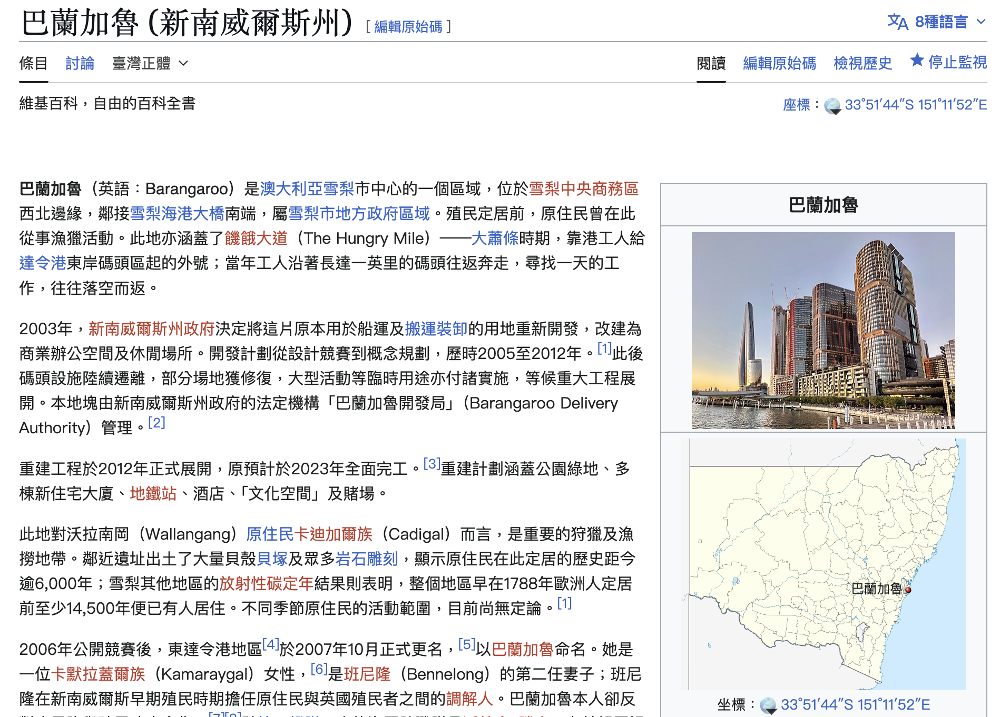

# WikiPolyDraft

<h2 align="center">WikiPolyDraft —— AI-assisted Wikipedia translation drafts</h2>



<p align="center">
  English | <a href="README.CN.md">中文</a>
</p>

<p align="center">
  
  
  
  
</p>

> **One article. Two languages. A draft that respects the rules — and the reviewer.**

WikiPolyDraft turns a Wikipedia URL into a **review-ready translation draft** — with attribution, a hallucination checklist, and the `{{LLM-assisted translation}}` template already in place. It does *not* publish. That's the point.

---

## ⚠️ Read this first

**This tool produces DRAFTS. Not publishable articles.**

- Wikipedia policy requires human review by an editor fluent in both languages before any translated content is published. **This tool does not replace that review.**
- The author is **not affiliated** with the Wikimedia Foundation or any Wikipedia community.
- The author assumes **no liability** for content published using this tool. Users are solely responsible for compliance with Wikipedia policies, copyright law, and the CC BY-SA 4.0 license.
- Pushing unreviewed AI translations into Wikipedia mainspace **violates community guidelines** ([Wikipedia:LLM-assisted translation](https://en.wikipedia.org/wiki/Wikipedia:LLM-assisted_translation)) and may get your account sanctioned.

If you're looking for a one-click "translate and publish" bot, this is not it — and we won't build that.

---

## Why it exists

The same Wikipedia article often looks very different across languages. The English entry for a topic might be a featured-quality 8,000 words; the Chinese entry might be three paragraphs — or missing entirely. Volunteers naturally edit in their native language, so the world's knowledge ends up unevenly distributed across language editions.

LLMs *can* help close the gap — but only if the human editor stays in the loop, and only if the tool makes their review job easier rather than harder. WikiPolyDraft is built around that constraint:

- Every draft carries a **DRAFT banner** and `reviewed=no` flag so it can't be mistaken for finished work.
- Every draft ships with a **`review-notes.md`** that lists what to check first — hallucination candidates, low-confidence sections, citation URLs that 404.
- The CLI has **no `--publish` flag**. It cannot call the Wikipedia edit API.

The first phase supports **English ↔ Chinese**.

---

## What you get

| What it does | What you get |
|--------------|--------------|
| **Fetches both sides** | Source article wikitext + langlinked target article (if it exists) so the LLM sees what's already there |
| **Translates section-by-section** | Section-level prompts keep context tight and let you re-run a single section without redoing the whole article |
| **Aligns with existing stubs** | If a target-language stub already exists, you get a per-section merge plan — keep, replace, or merge |
| **Generates the CC BY-SA paperwork** | Edit summary with source permalink + `{{Translated page}}` for the talk page — both required by the license |
| **Flags what to check** | `review-notes.md` lists hallucination candidates, weak sections, and (optionally) every citation URL that didn't HEAD-check 200 |
| **Refuses to publish** | No `--publish` flag, no edit-API client, by design |

---

## Quick start

### Install

```bash
pip install -e .
# or, with Anthropic standalone support:
pip install -e ".[anthropic]"
```

### Three steps (agent-driven, recommended)

Run this inside Claude Code, Codex CLI, or any agent host that can read prompt files and write back results.

**1. Prepare — fetch source + target, emit prompts**

```bash
wiki-translate prepare https://en.wikipedia.org/wiki/Brett_Whiteley \
  --target zh --out ./wt-work
```

**2. Translate — your agent reads `./wt-work/prompts/*.txt`, writes results to `./wt-work/translations/`**

In conversation: *"translate the prompt files in ./wt-work."* The agent handles it.

**3. Finalize — assemble the draft + attribution + review notes**

```bash
wiki-translate finalize ./wt-work --out ./output
```

### Standalone mode (no agent host, your own API key)

```bash
export ANTHROPIC_API_KEY=sk-...
wiki-translate translate https://en.wikipedia.org/wiki/Brett_Whiteley \
  --target zh --out ./output
```

---

## What ends up in `output/<title>/`

| File | Purpose |
|---|---|
| `<title>.wikitext` | Translated draft, with `{{LLM-assisted translation\|reviewed=no}}` and a DRAFT banner |
| `edit-summary.txt` | Paste-ready edit summary with source permalink (required by CC BY-SA) |
| `talk-template.txt` | `{{Translated page}}` for the article talk page (required by CC BY-SA) |
| `review-notes.md` | Hallucination candidates, low-confidence sections, source-verification results |

**Open `review-notes.md` first.** The DRAFT banner and `reviewed=no` flag are belt-and-suspenders: if a draft sneaks into mainspace before review, the maintenance category makes it visible to other editors.

---

## How it works

```
URL
  ↓
[prepare]  fetch wikitext + langlinks → split into sections → emit prompts
  ↓
[translate]  (agent or standalone LLM reads prompts, writes per-section drafts)
  ↓
[finalize]  assemble → add CC BY-SA attribution + DRAFT banner →
            cross-check refs → write review-notes.md
  ↓
human editor reviews → human editor publishes
```

Two LLM modes:

- **Agent-driven (default).** The CLI emits prompt files; an agent host (Claude Code, Codex, etc.) reads them, performs the translation in conversation, and writes results back. Zero API key required, allows interactive refinement, and the human is naturally in the loop.
- **Standalone.** The CLI calls an LLM API directly. Anthropic supported today; OpenAI / Gemini planned. Bring your own API key.

### Section alignment, when a target stub already exists

If the source article has a langlink to an existing target-language article, `prepare` additionally:

1. Fetches that target article.
2. Writes a coverage-report skeleton.
3. Emits `_alignment.prompt.txt` for the host agent — *which source sections map to which existing target sections?*

After translation, `finalize` upgrades the coverage report with the alignment result and a **per-section merge plan**: keep the existing target text, replace with the translation, or merge. Add `--check-urls` to also HEAD-check every citation URL and surface the failures in `review-notes.md`.

---

## Showcase — Barangaroo, NSW (en → zh, published)

A real Wikipedia article translated and published with WikiPolyDraft, end to end:

- **Source**: [Barangaroo, New South Wales](https://en.wikipedia.org/wiki/Barangaroo,_New_South_Wales) (en.wikipedia.org)
- **Published draft**: [巴蘭加魯 (新南威爾斯州)](https://zh.wikipedia.org/wiki/%E5%B7%B4%E8%98%AD%E5%8A%A0%E9%AD%AF_(%E6%96%B0%E5%8D%97%E5%A8%81%E7%88%BE%E6%96%AF%E5%B7%9E)) (zh.wikipedia.org)

Notable things the tool handled well: the `{{Infobox Australian place}}` parameters translated cleanly into zh, the `{{langx|en|...}}` template was used (not `{{lang-en|...}}`), and the per-section merge plan let the existing zh stub's lead be preserved while the rest of the article was expanded from scratch. The CC BY-SA edit summary + `{{Translated page}}` on the talk page were generated automatically.

<br>
<div style="display: flex; flex-wrap: nowrap; justify-content: center; align-items: center; gap: 16px;">
  
  
</div>
<br>

---

## Wikipedia policy compliance

This tool is designed around [Wikipedia:LLM-assisted translation](https://en.wikipedia.org/wiki/Wikipedia:LLM-assisted_translation):

1. The output is a **draft**; the human editor must be skilled in both languages to verify it.
2. The `{{LLM-assisted translation}}` template is inserted automatically.
3. `review-notes.md` highlights what the editor must check (hallucinations, sources, citations).
4. CC BY-SA 4.0 attribution is generated as required — edit summary + `{{Translated page}}` on talk.
5. The CLI has **no `--publish` flag** and does not call the Wikipedia edit API.

---

## Project status

Early — v0.3a. The pipeline runs end-to-end, the safeguards are in place, and the three examples reproduce offline. Expect rough edges in section alignment for highly asymmetric articles. PRs that improve translation quality, expand language pairs, or strengthen the review-assistance features are welcome.

**Not welcome**: PRs that add automated publishing to Wikipedia. See [CONTRIBUTING.md](CONTRIBUTING.md).

---

## License

MIT — see [LICENSE](LICENSE). Translated article content remains under CC BY-SA 4.0, inherited from Wikipedia.
